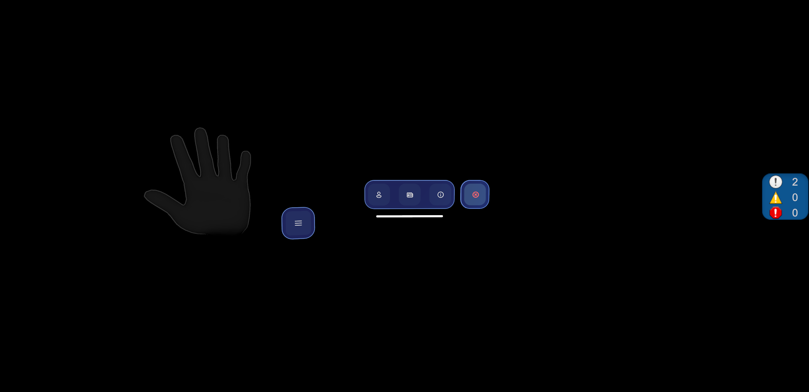
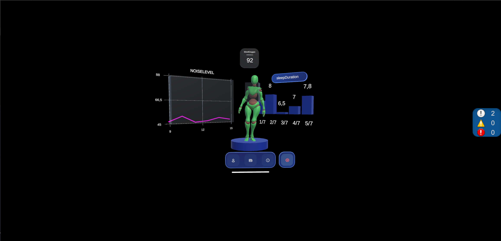
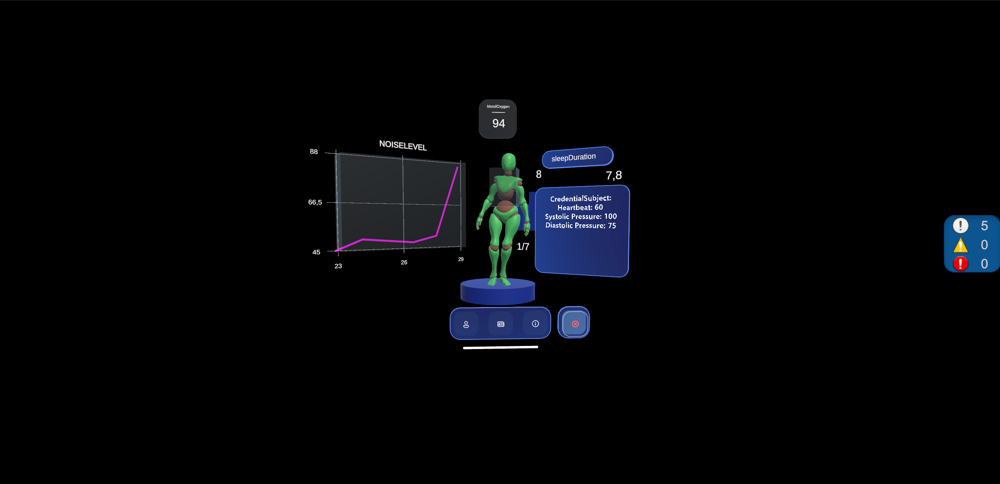
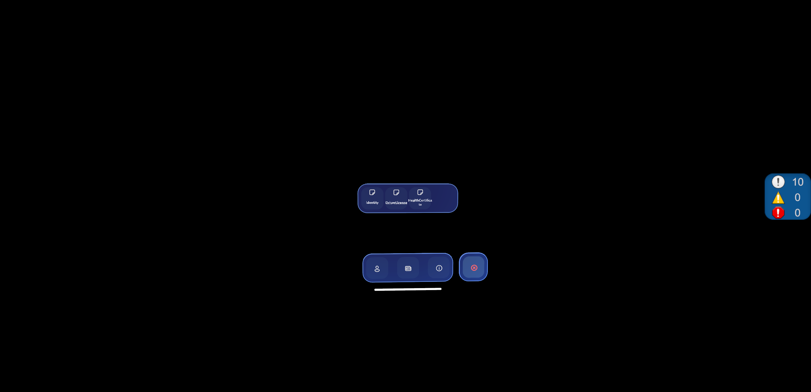
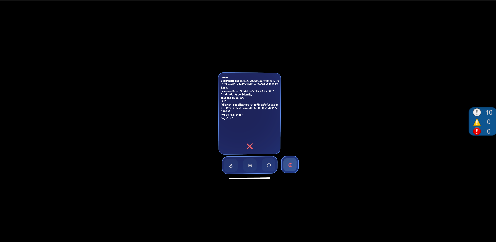
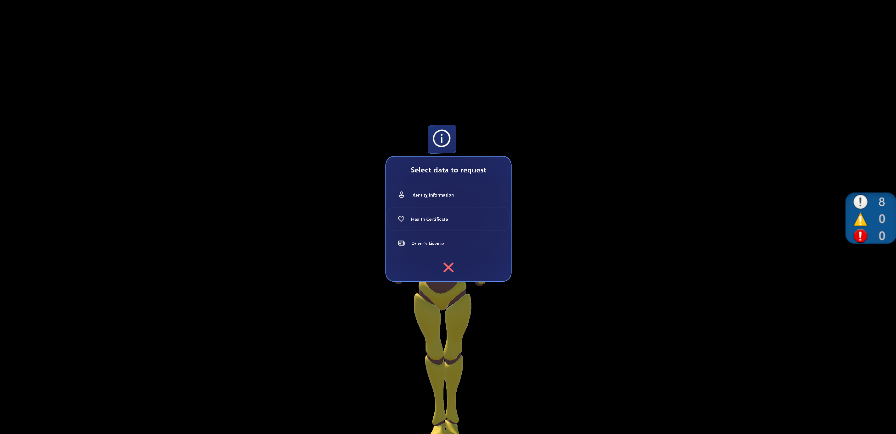
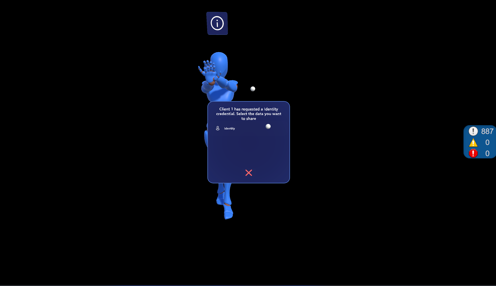
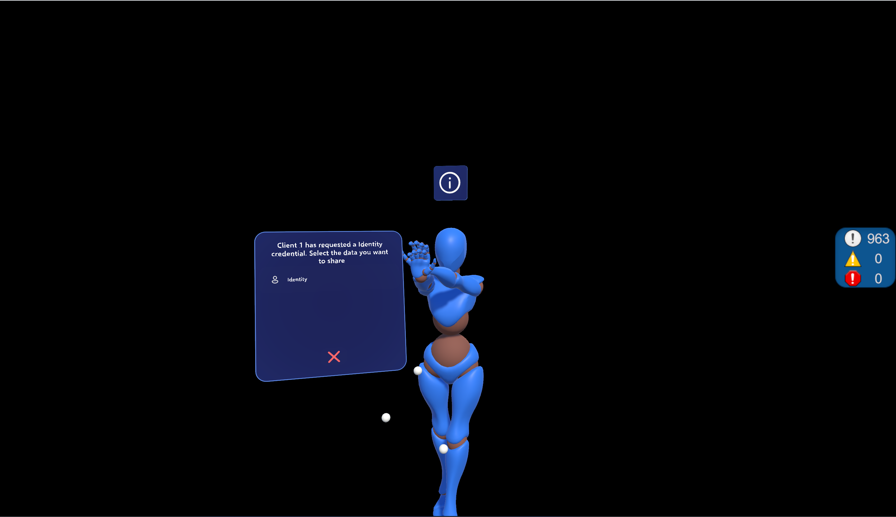
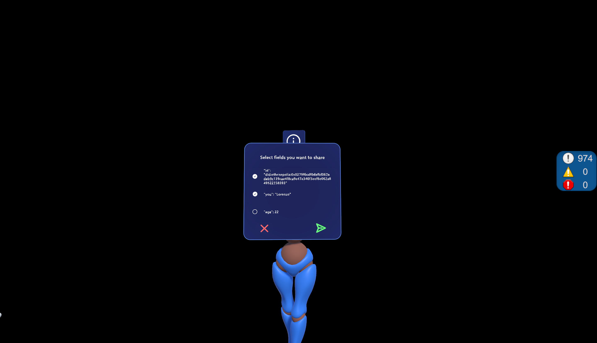
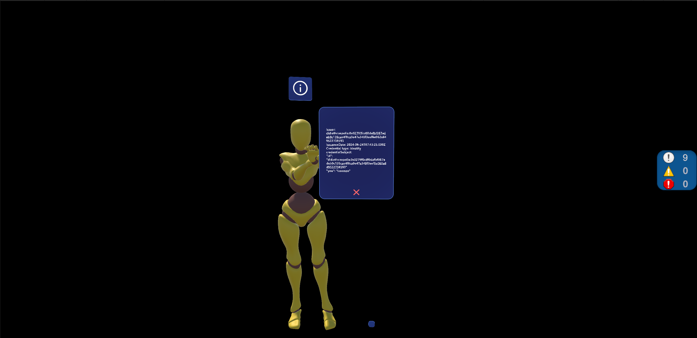

# SSI-METAVERSE

## Descrizione del sistema

Il sistema sviluppato può essere descritto come una simulazione (**HIGH-FIDELITY PROTOTYPE**) di un metaverso in cui più utenti possono interagire tra loro. Una volta che l’utente si è registrato al sistema HDT, può accedere al Metaverso.
Gli viene richiesto di inserire username e password del proprio account e, una volta effettuato correttamente il login, può decidere se avviare una nuova sessione (diventando host di una nuova stanza del Metaverso) o unirsi a una già esistente.

Il sistema HDT include un agente SSI che gestisce tutte le informazioni dell’utente. In particolare, l’agente comunica con il Metaverso e permette agli utenti di gestire le proprie Verifiable Credentials (VC), Decentralized Identities (DID) e Verifiable Presentations (VP).
Una volta effettuato l’accesso, guardando la propria mano l’utente può aprire un menu che consente di visualizzare:

1) Il proprio avatar HDT insieme ai dati provenienti da una piattaforma cloud collegata ai sensori indossabili utilizzati dall’utente;
2) Un elenco di tutti i propri dati sensibili, memorizzati come Verifiable Credentials;
3) Informazioni sul proprio account personale (DID, username, ecc.).

Gli utenti possono comunicare tra loro scambiandosi Verifiable Credentials grazie all’agente SSI integrato nell’applicazione del Metaverso. Possono richiedere uno specifico tipo di credenziale e, allo stesso tempo, decidere di condividere solo alcuni dei campi della credenziale richiesta attraverso il meccanismo di Selective Disclosure. Questo meccanismo permette agli utenti di mantenere la sovranità sui propri dati, scegliendo solo le informazioni che desiderano effettivamente condividere con l’utente remoto che ha effettuato la richiesta.

<table align="center">
  <tr>
    <td></td>
    <td></td>
    <td></td>
  </tr>
  <tr>
    <td></td>
    <td></td>
    <td></td>
  </tr>
  <tr>
    <td></td>
    <td></td>
    <td></td>
  </tr>
  <tr>
    <td></td>
    <td></td>
  </tr>
</table>

## FUNZIONAMENTO GENERALE

È necessario avviare il database utenti (userDatabase) e il server Veramo.
Per prima cosa, da Unity, può essere utile creare una server build, in modo da evitare di avere un host (client-server).
Successivamente, aprendo il progetto ed entrando in modalità play, l'utente vedrà davanti a sé una finestra contenente due campi: username e password. Qui l'utente deve inserire il corretto alias (che deve essere lo stesso utilizzato per accedere sia a Veramo che a userDatabase).
Dopo il login, apparirà una nuova finestra: l’utente può scegliere se entrare come host o come client. Se la server build è già stata creata in precedenza, l’utente può semplicemente accedere come client.
A questo punto, l'utente può accedere a tutte le funzionalità descritte nel paragrafo precedente.

## COME AVVIARE IL SISTEMA

Innanzitutto ricreare node_modules per "/Veramo" e "users_database":

```
cd SSI-Metaverse/HDT-Veramo_server/Veramo
npm install   # oppure yarn install
```

```
cd SSI-Metaverse/HDT-Veramo_server/users_database
npm install  # oppure yarn install
```

### PASSO 1 - AVVIO SERVER VERAMO E SERVER DB

per eseguire **server veramo**:

- andare in cartella HDT-Veramo_server/Veramo/veramo-agent/
- qui fare: node --loader ts-node/esm ./src/test_server.ts

se ci sono problematiche con l'esecuzione dei comandi qui su installare ts-node e typescript con:
npm install --save-dev ts-node typescript

poi riprovare ad eseguirli. ATTENZIONE -> Qui e' importante essere nella cartella specificata!

per eseguire **users_database**:

- andare nella cartella root HDT-VERAMO_SERVER/users_database
- qui fare: node index.js

se ci sono problematiche, provare ad installare express con:
npm install express

poi riprovare ad eseguire i comandi qui riportati

Al momento ci sono **2 utenti nel database di test**:
- username: Lorenzo ; password: default
- username: Gianni ; password: default

Essendo un **prototipo** non ci sono controlli su univocità di username o sulle password in particolare.
Il tutto è solo a scopo dimostrativo e funge da base facilmente espandibile.

### PASSO 2 - AVVIO SERVER UNITY E CONNESSIONE DEI CLIENT

Si apre la build "SSI-Metaverse_SERVER_BUILD" e si avvia il server con il tasto centrale
Da qui in poi sarà possibile per i vari client entrare nel metaverso condiviso.
N.B => Il server fatto in questo modo vuole simulare un server remoto, con un metaverso in questo caso condiviso tra tutti
senza presenza di lobby particolari

Poi, si apre la build "SSI-Metaverse_BUILD" per ogni client che si vuole connettere al metaverso.
Si inseriscono username e password (quelli presenti nel DB degli utenti).
N.B => Il sistema e' pensato per girare su HOLOLENS 2 o visore generico, quindi i comandi su PC fanno riferimento ai
comandi di MRTK : https://learn.microsoft.com/en-us/windows/mixed-reality/mrtk-unity/mrtk3-input/packages/input/input-simulation

Successivamente spostando il palmo della mano del simulatore esattamente al centro dello schermo e' possibile accedere
al menu. Da qui si possono consultare i dati dei sensori raccolti, le Verifiable Credential possedute e i dati dell'utente.


Interagendo con la "i" in testa ad un altro utente del metaverso, e' possibile richiedere delle informazioni seguendo
il paradigma dell'SSI.


## TECNOLOGIE USATE

### Tecnologie utilizzate e implementazione – Unity

La parte Unity del progetto rappresenta l’ambiente immersivo del **Metaverso**, in cui gli utenti possono autenticarsi, interagire tramite avatar 3D e scambiarsi Verifiable Credentials (VC) in modo sicuro grazie al server SSI basato su Veramo.


| Tecnologia / Framework | Utilizzo nel progetto |
|------------------------|-------------------------|
| **Unity (C#)** | Motore principale dell’applicazione, gestione logica client-side e rendering 3D |
| **MRTK (Mixed Reality Toolkit)** | Input, UI 3D, interazione con mani/gesture su HoloLens 2 o simulatore |
| **LiteNetLib (`ClientLite`, `ServerLite`)** | Comunicazione tra client nel metaverso (richieste, scambi di VC, posizioni avatar) |
| **HTTP + UnityWebRequest/HttpClient** | Comunicazione verso: <br> - Database utenti (`users_database` via Express/SQLite) <br> - Server SSI Veramo (per DID, VC, VP) <br> - Risorse Cloud (dati sensori simulati) |
| **JSON Serialization (`JsonUtility`)** | Conversione di VC, VP e dati cloud da/verso formato JSON |
| **Inverse Kinematics (IK)** | Movimento realistico degli avatar in VR (`IKTargetFollowVRRig.cs`) |
| **UI dinamica in VR/MR** | Finestre interattive per login, credenziali, dati salute, richieste SSI (`HdtMainMenu`, `SSIUserCommunication`) |
| **Google Drive (Cloud simulato)** | Utilizzato come sorgente remota per dati sensoriali. File pubblici (`.txt`/`.json`) vengono scaricati e letti da Unity (`CloudDataAcquisition.cs`) tramite URL HTTP. Aggiornamento periodico con Coroutine. |

Alcuni dei principali codici presenti nel progetto sono:

| File | Funzione |
|------|----------|
| `UsersDbRequestHandler.cs` | Invia richieste HTTP al database utenti (Express + SQLite) per login e autenticazione |
| `SSIRequestHandler.cs` | Gestisce richieste a Veramo (getDID, getVP, recupero credenziali), salvataggio delle VC in locale |
| `SSIUserCommunication.cs` | Gestione della comunicazione SSI tra utenti: invio richieste di credential, risposta, Selective Disclosure in UI |
| `ClientLite.cs / ServerLite.cs` | Gestisce la comunicazione in rete tra client (invio/ricezione messaggi VC, richieste, sincronizzazione utenti) |
| `HdtMainMenu.cs` | Gestione dei menu XR: visualizzazione VC, dati utente (DID, alias), logout, parametri sensori |
| `CloudDataAcquisition.cs` | Scarica periodicamente dati sensori simulati da Google Drive (temperatura corporea, ossigeno, rumore, sonno) |
| `SimpleCloudDataWindow.cs` | Mostra a schermo i dati cloud aggiornati in tempo reale |
| `IKTargetFollowVRRig.cs` | Applica inverse kinematics per mappare movimenti VR di testa e mani sull’avatar 3D |

---

### Tecnologie utilizzate e implementazione – Server SSI (Veramo)

Il server Veramo costituisce la componente dedicata alla **Self-Sovereign Identity (SSI)** nel progetto.  
Questa parte dell’applicativo permette di creare e gestire **Decentralized Identifiers (DID)**, **Verifiable Credentials (VC)** e **Verifiable Presentations (VP)**, che vengono utilizzati dagli utenti all’interno del metaverso per autenticarsi e scambiarsi informazioni in modo sicuro.

| Tecnologia / Libreria | Utilizzo nel progetto |
|------------------------|------------------------|
| **Node.js** | Ambiente di esecuzione per il server SSI |
| **TypeScript** | Linguaggio utilizzato per sviluppare l'agente Veramo in modo tipizzato e scalabile |
| **Veramo Framework** | Core SSI per gestione DID, firma/verifica di VC e creazione di VP |
| **Plugin Veramo** | Include: DIDManager, KeyManager, CredentialPlugin, DataStore, SelectiveDisclosure |
| **SQLite + TypeORM** | Database locale (`database.sqlite`) utilizzato per salvare DID, chiavi, credenziali e messaggi SSI |
| **KMS (Key Management System) + SecretBox** | Gestione sicura delle chiavi private con cifratura e storage locale |
| **Ethereum (did:ethr:sepolia) + Infura** | Utilizzato come rete blockchain per registrare e risolvere DID decentralizzati su testnet Sepolia |
| **Selective Disclosure** | Permette di creare Verifiable Presentations condividendo solo specifici campi (privacy-preserving) |
| **DID Resolver Plugin** | Risoluzione dei DID tramite `ethr-did-resolver` e `web-did-resolver` |
| **Express / HTTP** | Utilizzato per esporre API REST o JSON-RPC verso Unity o altri client |

I file TypeScript nel server permettono di gestire le operazioni SSI:

| File | Funzione |
|------|----------|
| `setup.ts` | Inizializza l’agente Veramo: configura DID, KMS, database SQLite, resolver, plugin e rete Ethereum (Sepolia via Infura). |
| `create-identifier.ts`   | Crea un nuovo DID per l’agente o per un utente |
| `create-credential.ts`   | Genera e firma una Verifiable Credential |
| `verify-credential.ts`   | Verifica autenticità e firma di una VC |
| `create-presentation.ts` | Crea una Verifiable Presentation (anche con Selective Disclosure) |
| `list-identifiers.ts`    | Elenca tutti i DID creati e gestiti |
| `list-credentials.ts`    | Mostra le credenziali salvate dall’agente SSI |
| `test_server.ts`         | Avvia l’agente Veramo, configura plugin e storage |
